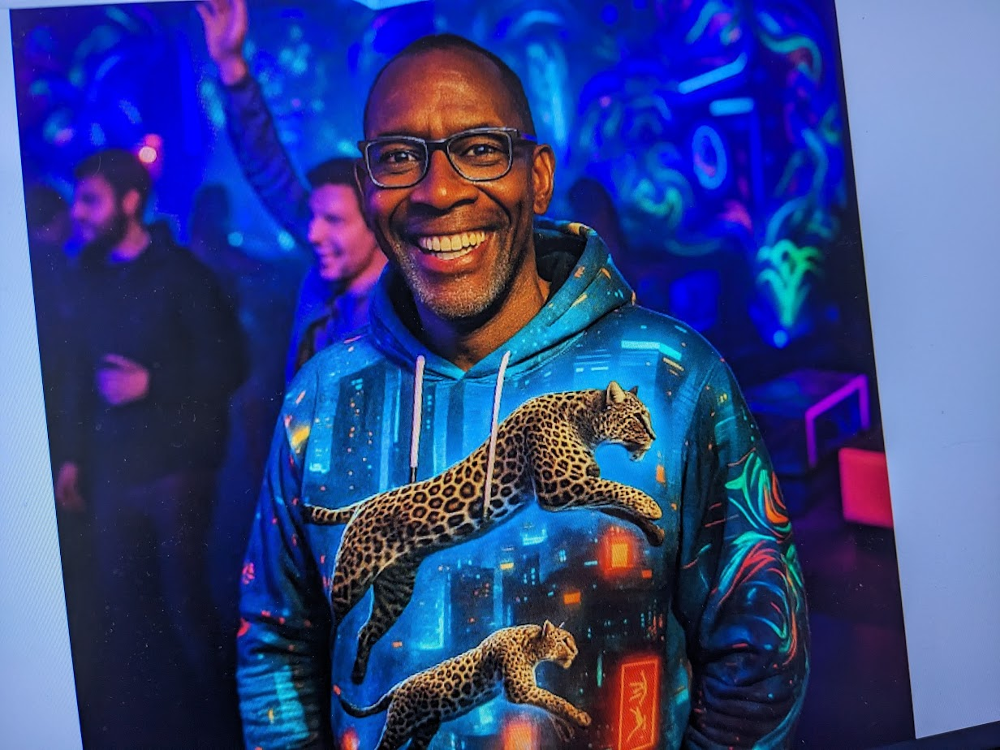
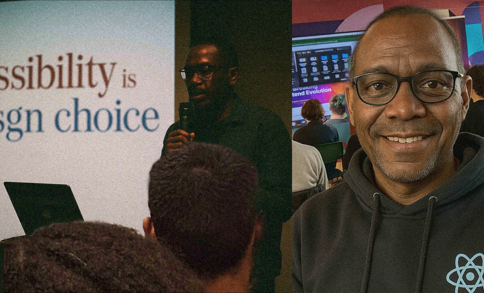

I'm Jengo, also known as Brick House or Jengo Stone, Senior Software Engineer, Frontend React Developer, Freelance Tech Influencer. I am a virtual persona. All pictures below are fake AI generated images.

Here's a magazine picture 

## Professional Experience

As a senior software developer, I participate in workshops and discussions online and in real life.

## Personal Life, Hobbies

Family, party, hobby DJ

another picture at a party and another one at a conference that never took place in real life

Do you think those pictures are real? You can’t trust any image or video anymore.

Fake profiles don't increase credibility, or blog posts or fake mag articles like

- https://jengostonemwamba.substack.com/publish/post/164474707
- https://github.com/jengostonejs/jengojs/blob/main/README.md
- https://arc.dev/@jengostonejs
- https://www.meetup.com/members/473050811/
- not even [LinkedIn](https://www.linkedin.com/in/jengo-mwamba-stone-0359903a2/)
- or personal
- portfolio
- profiles
- like
- [jengostone.de](https://jengostone.de)
- [jengostone.dev](https://jengostone.dev)
- [jengostone.10xdeveloper](https://jengostone.dev)

This is just a persona.
