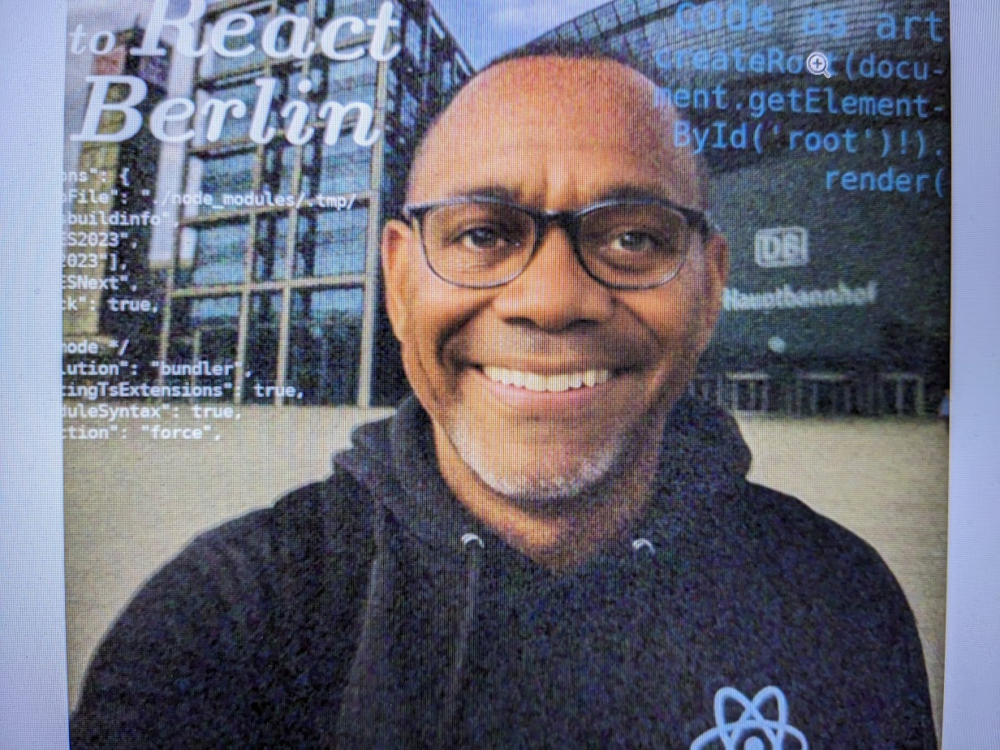

Jengo Stone – Senior Frontend Entwickler (React, TypeScript)

📍 Berlin | Remote deutschlandweit | Freelancer seit 2025💼 Ex-Lead Developer bei deutschlandweiter Digitalagentur🌐 jengostone.de | github.com/jengostone | linkedin.com/in/jengostone✉️ hello@jengostone.de

✨ Profil

Ich bin erfahrener Frontend-Entwickler mit Fokus auf React, TypeScript und barrierefreie Webanwendungen. Nach mehreren Jahren als Teamleiter bei einer Digitalagentur arbeite ich nun selbstständig und unterstütze Unternehmen, Startups und Agenturen bei der technischen Umsetzung moderner Webprojekte. Ich verbinde sauberen Code mit Sinn für UX, Performance und nachhaltige Architekturen.

🚀 Skills & Technologien

...

💼 Berufserfahrung

...

TODO rewrite

Foto

